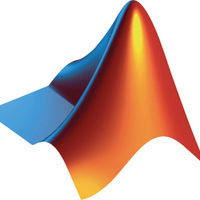

# Who am I?
- :books: A student studying Computer Science with a concentration in Artificial Intelligence at Stanford University 
- :art: Exploring the intersection of Art/Design and Computer Science
- :mag_right: Heavily interested in learning more about Web Dev with an emphasis on UI/UX
  - Check out my in-progess website: <a href="">The Beeping Button</a>

## My languages
 &nbsp;   &nbsp;
 &nbsp;
 &nbsp;
 &nbsp;
 &nbsp;
 &nbsp;
 &nbsp;

# Contact Me

